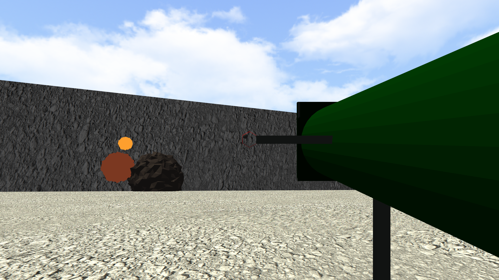

# T3Vtech-3




T3Vtech-3 is a 3D game engine that offers a C API to be easily usable in C and C++. 

A detailed description of the API can be found [here](doc/api.md)

## Features

Currently the engine has the following features:


-3D rendering
	- lighting with gouraud shading
		-point lights
		-ambient lighting
		-directional lights
	- OBJ model loading
	- textures from BMP, JPG, PNG
	- transformations
		-translations
		-scaling
		-rotation with quaternions
	- camera system
		-translation
		-rotation
		-setting field of view
-antialiasing
-input
	-mouse
	-keyboard
	-gamepads

## Dependencies

T3Vtech-3 currently needs SDL2 and GLEW as a dependency. The other dependency that is used is used as a submodule.

## Building

If you are trying to build the repository for the first time then you need the following git commands

```
git clone https://github.com/tevoran/T3Vtech-3.git
git submodule update --init --recursive
```

and to prepare the repository a build directory has to be created.

```
mkdir build
cd build
```

The final step is using cmake and on Linux make to build the 
engine.

```
cmake ..
make
```

